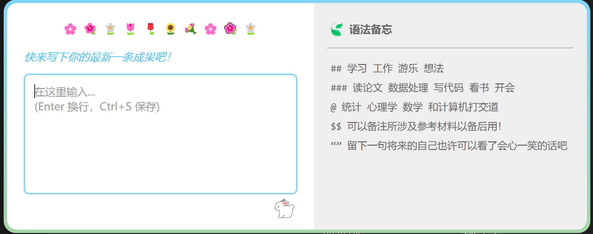

# 🍒 HappyFruit 使用手册

**HappyFruit** 是一个个人专属的成就与生活记录工具。它采用：

- 快捷键唤起“成果记录”输入窗口
- 正则表达式解析输入
- Github “种草图” 风格统计

帮助你记录生活点滴。


## 🚀 快速开始

### 1. 启动输入窗口

双击根目录下的 `run.bat`，或双击 `setup_startup.bat` 设置开机自启动。

* 程序会在后台静默运行。
* **唤出窗口**：随时按下全局快捷键 `Ctrl + Space`。请输入您的最新一条成就！
* **隐藏窗口**：按下 `Ctrl+S` 保存输入内容的同时窗口也被隐藏。（如果输入内容为空，将直接退出。）



### 2. 查看统计大屏

双击根目录下的 `view_stats.bat`, 浏览器会自动打开，展示你的成就统计。


## 📝 记录语法指南

HappyFruit 使用一套灵活的标记语法来结构化你的记录。所有标记均支持缩进（前面可以有空格）。

| 符号 | 含义 | 说明 | 示例 |
| --- | --- | --- | --- |
| `##` | 情境 | 当时的大状态。支持多个。 | `## 学习` `## 工作 生活` |
| `###` | 动作 | 具体在做什么事。 | `### 写代码` `### 读论文` |
| `@` | 领域 | 涉及的知识领域。支持多个。 | `@ 统计` `@ 心理学` |
| `$` | 参考材料 | 可以备注所参考的书籍、链接等。 | `$PyQt6+正则表达式+Streamlit$` `$PyQt6 Docs$` |
| `""` | 碎碎念 | 你的心得、灵感或吐槽。 | `“Gemini 天天骗我”` |

**示例条目：**

```text
## 学习 工作 
### 写代码
@ 和计算机打交道 
$PyQt6+正则表达式+Streamlit$
“暂时好像能用了，但估计可能还有些问题……”
```

**💡 提示**：
- 语法备忘：不用担心忘记语法！输入框右侧提供了“语法备忘”。
- 输入框操作：写完后按 `Ctrl + S` 保存并关闭窗口。
- 动态联想：为统计准确，**请确保你每次描述同一情境/动作/领域时使用的是完全相同的词**。输入框右侧的“语法备忘”会根据你过去输入过的内容自动更新，提示已有词语。

## 🎨 统计图表说明

- **最近专注领域/活动/忙于**：GitHub 种草图风格的像素热力图
- 横轴：时间（根据筛选范围自动切换为 日/周/月）。
- 颜色：越深代表频次越高。
- **每日活力**：显示每日记录条目数量的折线图。
- **碎碎念时间轴**：随机展示你的部分碎碎念。也许它们在很期待被未来的你阅读！

**Happy Logging!** 🍒

---
## 📂 文件结构说明
HappyFruit/
├── data/                       # 数据存储目录
│   ├── daily_log.jsonl         # 原始日志数据
│   ├── parsed_logs.jsonl       # 解析后的缓存数据 (由脚本生成)
│   └── hints_config.json       # 动态语法提示配置
├── src/                        # 源代码目录
│   ├── app_stats.py            # 统计大屏主程序（Streamlit）
│   ├── batch_add.py            # 批量补录脚本
│   ├── config_manager.py       # 配置管理模块
│   ├── data_manager.py         # 数据读写模块
│   ├── gui_app.py              # 输入窗口主程序 (PyQt6)
│   ├── parser.py               # 正则表达式解析
│   └── process_logs.py         # 数据批量解析脚本
├── .venv/                      # Python 虚拟环境
├── install.bat                 # 依赖安装脚本
├── requirements.txt            # 项目依赖列表
├── run.bat                     # [入口] 启动输入窗口（启动后使用快捷键唤起窗口）
├── setup_startup.bat           # 设置开机自启动
├── view_stats.bat              # [入口] 启动统计大屏 (含自动更新)
└── README.md                   # 说明文档

---

## 🛠️ 高级功能

### 批量补录

如果你忘记记录某几天的内容，可以使用脚本批量添加，系统会自动在指定时间段内生成随机时间戳。

1. 打开 `src/batch_add.py`。
2. 编辑 `ENTRIES_TO_ADD` 列表，格式如下：
```python
(
    "2026-01-01 14:00",  # 开始时间
    "2026-01-01 18:00",  # 结束时间
    "## 学习 ### 看书 @历史 “补录一条记录”" # 内容
)
```
3. 运行补录脚本：
```powershell
.venv\Scripts\python src\batch_add.py
```